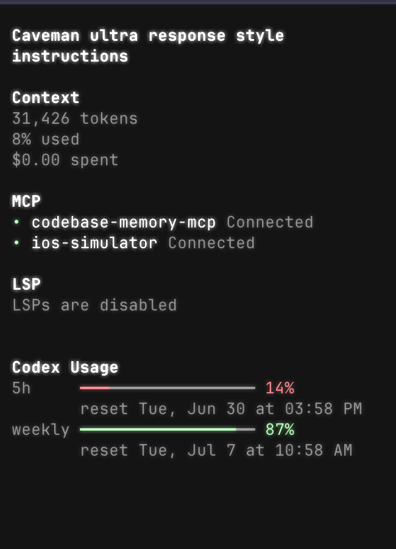

# @ternetin/opencode-codex-multiplexer

OpenCode TUI plugin for switching saved Codex/OpenAI auth profiles and showing Codex usage windows.



## Install

Add the TUI plugin to `~/.config/opencode/tui.json`:

```json
{
  "plugin": ["@ternetin/opencode-codex-multiplexer"]
}
```

Optional hot-switch hook in `~/.config/opencode/opencode.json`:

```json
{
  "plugin": ["@ternetin/opencode-codex-multiplexer"]
}
```

Restart OpenCode after changing plugin config.

OpenCode installs npm plugins from config automatically. You do not need to run `bun add` unless you want to test or use the package from another JavaScript project.

For a local unpublished checkout, use absolute paths instead:

```json
{
  "plugin": ["/Users/valentin/Documents/Perso/opencode-codex-multiplexer/src/tui.tsx"]
}
```

```json
{
  "plugin": ["/Users/valentin/Documents/Perso/opencode-codex-multiplexer/dist/server.js"]
}
```

## Commands

- `codexmx:save` saves current `auth.json` and `account.json` into a named Codex profile.
- `codexmx:switch` switches current live Codex auth to a saved profile.
- `codexmx:show` shows redacted debug info about live and selected auth.

Slash commands:

- `/codexmx-save`
- `/codexmx-switch` or `/codexmx`
- `/codexmx-show`

## Storage

Profiles are stored under:

```txt
$OPENCODE_DATA_DIR/codexmx/profiles/
```

Default `OPENCODE_DATA_DIR` is `~/.local/share/opencode`.

Profile files:

- `<name>.auth.json`
- `<name>.account.json`
- `.current`

Files are written with `0600` permissions.

## Hot Switch

The TUI switch updates profile files immediately. Usage API refreshes without restart.

Model request hot-switch is best effort through the server plugin. It injects the selected profile bearer token in `chat.headers` for OpenAI/Codex-like providers. This affects new requests only. If OpenCode/provider code overwrites headers after plugin hooks, restart remains required.
